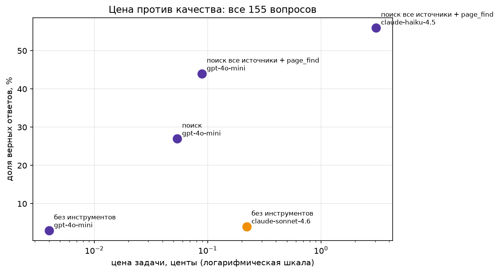
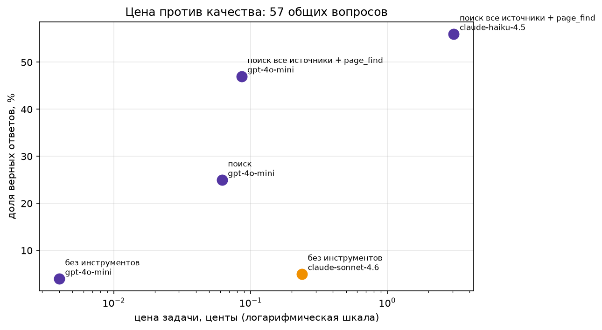
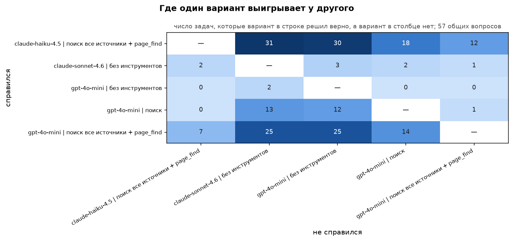
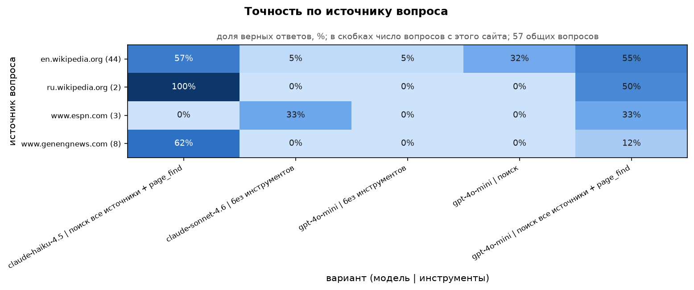
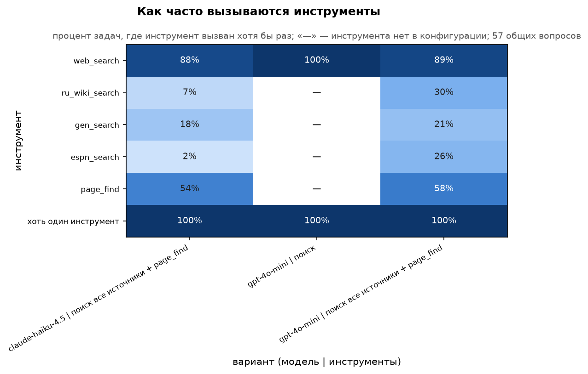
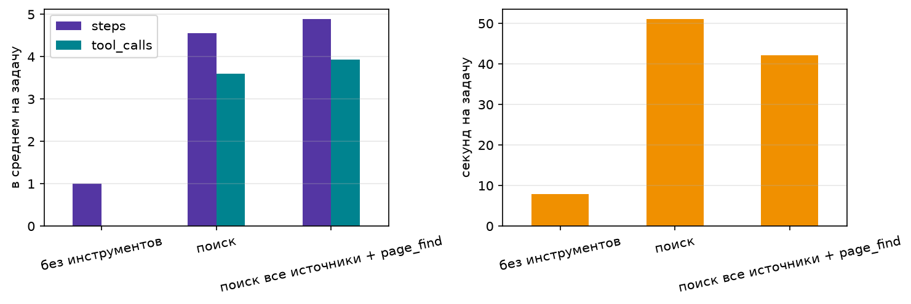

# ReAct-агент для вопросов о свежих событиях

Экспериментальный агент на чистом Python без фреймворков: цикл ReAct (рассуждение → вызов инструмента → наблюдение), набор инструментов и учёт денег и времени на каждый вызов модели. Модели вызываются через OpenRouter.

Главный вопрос проекта: **может ли агент на дешёвой модели с хорошими инструментами обойтись дешевле сильной модели без инструментов и при этом отвечать не хуже?** Проверяем это на вопросах о событиях, которые случились после даты среза знаний моделей. 

## Запуск ноутбука

Зависимости проекта управляются через [uv](https://docs.astral.sh/uv/): список лежит в `pyproject.toml`, точные версии зафиксированы в `uv.lock`. 

1. Установка uv:

   ```bash
   curl -LsSf https://astral.sh/uv/install.sh | sh
   ```

2. Создание окружения `.venv` и установка зависимостей.

   ```bash
   uv sync
   ```

3. Скопируйте `.env.example` в `.env` и впишите ключ OpenRouter (его можно получить на https://openrouter.ai/keys):

   ```bash
   cp .env.example .env
   # OPENROUTER_API_KEY=sk-or-...
   ```

   Ноутбук загружает `.env` через `python-dotenv` и сразу останавливается с ошибкой, если ключа нет.

4. Запустите JupyterLab из корня репозитория и откройте `ai-agent-01.ipynb`:

   ```bash
   uv run jupyter lab
   ```

   Если вы работаете в VS Code или PyCharm, выберите интерпретатор `.venv/bin/python` в качестве ядра ноутбука.


## Что есть в ноутбуке

В `ai-agent-01.ipynb` агент собирается по шагам:

1. **Один вызов модели.** `Ledger` пишет в журнал токены, стоимость и время каждого вызова, `chat()` отправляет запрос с повтором при ошибке. Сравниваем по цене и скорости дешёвую (`gpt-4o-mini`), среднюю (`claude-haiku-4.5`) и сильную (`claude-sonnet-4.6`) модели.
2. **Ответ по схеме и температура.** Ответ в JSON по схеме Pydantic и проверка этого ответа, а также влияние температуры на разнообразие ответов.
3. **Проверка ответа.** `normalize` и `is_correct` приводят к одному виду числа и даты, в том числе на русском.
4. **Цикл ReAct.** Инструменты регистрируются вместе со схемой аргументов, `agent_loop` чередует вызовы модели и инструментов, не даёт повторять одинаковые вызовы и доводит модель до ответа, даже если инструмент сломан.
5. **Инструменты.** Калькулятор, запуск Python в отдельном процессе, поиск по вступлениям англоязычной и русскоязычной Википедии, GEN и ESPN, а также `page_find`, который осуществляет поиск по полному тексту найденной статьи.
6. **Прогон, трейсы, деньги.** `run_tasks` прогоняет набор вопросов в заданной конфигурации и сохраняет трейс каждого запуска в `traces/<конфигурация>/<модель>/<id>.json`. `report` собирает итоговую таблицу, в которой главная колонка - `cost_per_correct`, то есть цена одного верного ответа.
7. **Каскад.** Сначала отвечает дешёвая модель и оценивает свою уверенность. Если уверенность ниже порога, вопрос передаётся сильной модели.

## Особенности

1. Доработка проверки ответа: `is_correct` засчитывает ответ, если нормализованный эталон в нём содержится, а `normalize` приводит к одному виду числа и даты, в том числе их русские варианты. Нормализация:

- даты: `March 15, 2026`, `15th of March`, `2026-03-15` и `15 марта 2026 года` превращаются в `15 march 2026`, поэтому эталон `15 March` находится в любом из них;
- числа словами становятся цифрами: `nine`, `девять` → `9`, `Thirty thousand`, `30 тысяч` → `30000`;
- множители раскрываются: `1.7 million`, `1,7 млн`, `8.15m`, `£30.4bn` → целое число, как и `1,700,000` и `700 000`;
- десятичная запятая равна точке: `238,28` = `238.28`, а запятая перед тремя цифрами считается разделителем тысяч;
- порядковые окончания и нули в конце дроби убираются: `11th`, `11-е` → `11`, `146.70` → `146.7`; `ё` заменяется на `е`;
- если эталон это число с единицами (`28 people`, `41.5 °C`, `at least six`), достаточно, чтобы это число стояло в ответе отдельным словом: `28` засчитывается, а `21` внутри `2021` нет.

2. Поскольку добавлены русские вопросы, в `SYSTEM` добавлено «на языке вопроса, имена и названия пиши как в источнике». 

3. Так как добавлены вопросы с трех сайтов помимо англоязычной википедии, добавлены инструменты поиска по вступлениям англоязычной и русскоязычной Википедии, GEN и ESPN, а также `page_find`, который осуществляет поиск по полному тексту найденной статьи. Все поисковые инструменты принимают короткий запрос (`SearchArgs`) и отвечают в одном формате: `[название статьи] первые 5000 символов текста` или `No data`. Если сайт не ответил или вернул ошибку, запрос повторяется до трёх раз с паузой.

| Инструмент | Где ищет | Что делает |
|---|---|---|
| `web_search` | англоязычная Википедия | Ищет статью по запросу через встроенный поиск Википедии, берёт самую подходящую и возвращает только её вступление: первые абзацы до оглавления. |
| `ru_wiki_search` | русская Википедия | Так же находит самую подходящую статью, но скачивает всю страницу и очищает её от вёрстки и кнопок «править». Агент видит начало статьи, а не только вступление. |
| `gen_search` | новостной сайт GEN (биотех) | Задаёт запрос поиску самого сайта и берёт из выдачи статью, у которой заголовок совпадает с запросом, а если такой нет - первую. Возвращает её текст без вёрстки. |
| `espn_search` | спортивный сайт ESPN | Задаёт запрос поиску ESPN, оставляет из выдачи только статьи (без видео и страниц команд), открывает выбранную и собирает из неё абзацы текста. |
| `page_find` | статья, уже найденная одним из поисков выше | Работает как Ctrl+F: заново скачивает статью целиком, режет её на предложения и возвращает только те, в которых встречается хотя бы одно из заданных слов. |

Зачем нужен `page_find`: поиск показывает агенту только начало статьи, а нужный факт часто лежит в её середине. Например, про аварию в аэропорту Ханэда написано где-то внутри длинной статьи «2026 in Japan». Поэтому агент действует в два шага:

1. `web_search("2026 in Japan")` → получает `[2026 in Japan] …` и видит, что во вступлении ответа нет;
2. `page_find(title="2026 in Japan", keywords=["Haneda"], site="en_wiki")` → получает одно-два предложения со словом «Haneda».

В `site` агент указывает, каким поиском он нашёл статью, чтобы `page_find` скачал её с того же сайта. Так агент читает несколько нужных предложений вместо всей статьи, а это дешевле. Если статья не найдена, инструмент отвечает `Статья … не найдена`, а если ни одно предложение не подошло - `No data`.


## Набор вопросов

Вопросы лежат в `data/fresh_2026.jsonl`, всего **155**. В каждой записи есть поля `id`, `question`, `answer` (короткий эталонный ответ), `evidence` (предложение из источника, в котором есть ответ), `page` и `url`.

### Основная часть: 125 вопросов о событиях 2026 года

`fresh-0` … `fresh-124` собраны автоматически скриптом `fetch_fresh.py`. Скрипт взял факты с датами из шестидесяти с небольшим обзорных статей англоязычной Википедии о 2026 годе (по странам, наукам и видам спорта). Из каждого факта дешёвая модель сделала вопрос с коротким ответом. Затем остались только вопросы, на которые Sonnet 4.6 без инструментов ответил неверно: на 107 из 125 он написал «unknown», на 18 назвал не тот факт.

Поле `agent_ok` показывает, справился ли с вопросом агент на дешёвой модели с поиском и чтением страницы. Таких вопросов 72 из 125 (58 %). 

### Дополнение: 30 вопросов по интересам

`fresh-125` … `fresh-154` добавлены дополнительно, по темам:

| Тема | id | Вопросов |
|---|---|---|
| Структурная биоинформатика | 125-132 | 8 |
| Искусственный интеллект | 133, 134, 136-139 | 6 |
| Аниме | 140-147 | 8 |
| Фигурное катание | 135, 148-154 | 8 |

Все вопросы касаются событий **с 1 января 2025 года** до момента создания проекта (сентябрь 2026). Источников четыре, и для каждого у агента есть свой инструмент поиска:

| Источник | Вопросов |
|---|---|
| en.wikipedia.org | 17 |
| genengnews.com (GEN) | 8 |
| espn.com | 3 |
| ru.wikipedia.org | 2 |

Кандидаты в вопросы подбирала модель Claude Opus 5.5 по статьям из этих источников. Затем проверялось, что ответ дословно есть в цитате `evidence`.

### Проверка свежести

Вопрос считается свежим, если сильная модель без инструментов на него не отвечает. Критерий: верных ответов не больше 20 %.

Скрипт `check_fresh` может как проверить вопросы на Sonnet, так и взять готовые ответы из трейсов ноутбука (конфигурация «без инструментов», `claude-sonnet-4.6`). Флаг `--ids` выбирает диапазон номеров вопросов:

```bash
T="traces/без инструментов/claude-sonnet-4.6"
uv run python check_fresh.py data/fresh_2026.jsonl --traces "$T" --ids 0-124    # исходные
uv run python check_fresh.py data/fresh_2026.jsonl --traces "$T" --ids 125-154  # добавленные
uv run python check_fresh.py data/fresh_2026.jsonl --traces "$T"                # все
```

Без `--traces` флаг `--sonnet` заново опрашивает модель, для этого нужен ключ. 

| Часть набора | Вопросов | Верно по скрипту | Критерий ≤ 20 % |
|---|---|---|---|---|
| исходные, `fresh-0…124` | 125 | 3 (2 %) | пройден |
| добавленные, `fresh-125…154` | 30 | 0 (0 %) | пройден |
| все | 155 | 3 (2 %)  пройден |

Где Sonnet ответил верно:

| id | Вопрос (кратко) | Эталон | Ответ Sonnet |
|---|---|---|---|
| fresh-24 | что объявлено по всему Уэльсу в июле 2026 | a drought | drought |
| fresh-27 | кого Зальцбургский фестиваль отправил в отпуск | Markus Hinterhäuser | Markus Hinterhäuser |
| fresh-92 | кто вернулся на пост губернатора Синалоа | Rubén Rocha Moya | Rubén Rocha Moya |

Среди 125 исходных вопросов при сборке набора Sonnet ошибся на всех. В этом прогоне он ответил верно на три, потому что его ответы от прогона к прогону немного различаются.

## Результаты

Сравниваются пять вариантов (`VARIANTS` в ноутбуке):

| Вариант | Модель | Инструменты |
|---|---|---|
| сильная без инструментов | claude-sonnet-4.6 | - |
| дешёвая без инструментов | gpt-4o-mini | - |
| дешёвая + поиск | gpt-4o-mini | `web_search` |
| дешёвая + все источники | gpt-4o-mini | `web_search`, `ru_wiki_search`, `gen_search`, `espn_search`, `page_find` |
| средняя + все источники | claude-haiku-4.5 | те же, что у дешёвой |

Средняя модель тратила кредиты в 35 раз быстрее дешёвой, поэтому была оценена на части вопросов: первые 27 из основной части (`fresh-0` … `fresh-26`) и все 30 дополнительных.

`accuracy` - доля верных ответов; `cost_per_task` - сколько в среднем стоит одна задача, в долларах; `cost_per_correct` - сколько стоит один верный ответ (все траты делим на число верных); `avg_steps` - сколько раз в среднем вызывалась модель; `avg_seconds` - время на задачу.

Сырые результаты по каждому вопросу - `img/results_raw.csv`

Таблицы - `img/results_table.md`, `img/results_table_common.md`

Трейсы - в `traces/<вариант>/<модель>/<id>.json`.

### Все 155 вопросов

| config | model | n | accuracy | cost_per_task | cost_per_correct | avg_steps | avg_seconds |
|---|---|---|---|---|---|---|---|
| без инструментов | gpt-4o-mini | 155 | 0.03 | 0.00004 | 0.00133 | 1 | 7.9 |
| поиск | gpt-4o-mini | 155 | 0.27 | 0.00054 | 0.00201 | 4.55 | 51 |
| поиск все источники + page_find | gpt-4o-mini | 155 | 0.44 | 0.00089 | 0.00203 | 4.88 | 42.1 |
| без инструментов | claude-sonnet-4.6 | 155 | 0.04 | 0.00221 | 0.05719 | 1 | 10.2 |
| поиск все источники + page_find | claude-haiku-4.5 | 57 | 0.56 | 0.03069 | 0.05466 | 4.79 | 46 |



### 57 общих вопросов

| config | model | n | accuracy | cost_per_task | cost_per_correct | avg_steps | avg_seconds |
|---|---|---|---|---|---|---|---|
| без инструментов | gpt-4o-mini | 57 | 0.04 | 0.00004 | 0.00121 | 1 | 9.3 |
| поиск | gpt-4o-mini | 57 | 0.25 | 0.00062 | 0.00251 | 4.86 | 50.5 |
| поиск все источники + page_find | gpt-4o-mini | 57 | 0.47 | 0.00086 | 0.00182 | 4.91 | 39.1 |
| без инструментов | claude-sonnet-4.6 | 57 | 0.05 | 0.00238 | 0.0453 | 1 | 7.8 |
| поиск все источники + page_find | claude-haiku-4.5 | 57 | 0.56 | 0.03069 | 0.05466 | 4.79 | 46 |



### Выводы по результатам

1. **Без инструментов свежие вопросы не решает никто.** Sonnet отвечает верно на 4 %, дешёвая модель на 3 %. Ожидаемо, поскольку вопросы о событиях после среза знаний.
2. **Один поиск по Википедии дает значительные улучшения.** Дешёвая модель поднимается с 3 % до 27 %, а задача стоит $0.00054 - в 4 раза дешевле, чем один ответ Sonnet без инструментов.
3. **Лучший дешёвый вариант - все источники + `page_find`.** 44 % на всём наборе и 47 % на общих вопросах. Задача стоит $0.00089, в 2,5 раза дешевле ответа Sonnet.
4. **Средняя модель с теми же инструментами точнее, но намного дороже.** 56 % против 47 % на общих вопросах, но задача стоит $0.031: в 35 раз дороже дешёвого агента и в 13 раз дороже Sonnet без инструментов.
5. **57 вопросов представляют весь набор.** Точность вариантов на 57 и на 155 вопросах отличается на 2-3 процентных пункта, поэтому выводы по общим вопросам теоретически можно было бы перенести на весь набор.

Итого, наблюдаем, что дешёвый агент оказался на порядок точнее и при этом дешевле сильной модели без инструментов. Однако, стоит отметить и тот факт, что более половины вопросов остались без верного ответа, а средняя модель с теми же инструментами решала больше. Ниже продемонстрировано, где именно дешёвый агент проигрывает и почему.

### Кто где выигрывает



Строка - вариант, который справился, столбец - вариант, который на той же задаче ошибся. Например, число 12 в строке haiku и столбце дешёвой модели со всеми источниками значит: «в 12 задачах средняя модель ответила верно, а дешёвая нет».

- **Средняя и дешёвая ошибаются в разных местах.** Средняя обходит дешёвую в 12 задачах, но и сама проигрывает ей в 7. Хотя бы одна из двух решила 39 вопросов из 57 (68 %) - заметно больше, чем любая по отдельности (47 % и 56 %). Поэтому вариант каскадной модели может дать заметный прирост (здесь, однако, стоит учесть увеличение стоимости).
- **Все источники почти полностью покрывают простой поиск.** Расширенный вариант решил 14 задач, которые простой поиск не решил, а обратных случаев всего 1.
- **Память Sonnet почти не помогает.** Он решил только 1-3 задачи, которые не решили агенты с поиском.
- **17 вопросов из 57 не решил ни один вариант.**

### Точность по источнику вопроса



- **Английская Википедия** (44 из 57 вопросов): дешёвая модель со всеми источниками почти догоняет среднюю - 55 % против 57 %.
- **GEN** (8 вопросов): Дешёвая модель решила 1 вопрос из 8, средняя - 5 из 8. Статьи GEN длинные и научные, нужный факт надо найти в середине текста, средняя модель с этим справляется заметно лучше.

### Как часто вызываются инструменты



В ячейке - процент задач, где инструмент вызвали хотя бы раз; прочерк значит, что у варианта такого инструмента нет.

- **Дешёвая модель вероятно перебирает поисковики наугад.** `espn_search` она вызывает в 26 % задач, хотя вопросов с ESPN всего 3 из 57 (5 %), а `ru_wiki_search` - в 30 % при 2 русских вопросах. Несмотря на перебор, прирост от добавленных инструментов по сравнению с наличием только поиска при этом также наблюдается. Средняя выбирает источник точнее: 2 % и 7 %. 
- **`page_find` обе модели используют одинаково часто** (54-58 %): дочитать страницу после поиска стало шаблонным вторым шагом.

### Шаги и время



- Агент с инструментами вызывает модель в среднем около 5 раз на задачу и делает около 4 вызовов инструментов. Отвечает он за 40-50 секунд вместо 8 секунд без инструментов: точность оплачивается временем.

### Сколько добавляет средняя модель

```
Средняя модель вместо дешёвой, те же инструменты, 57 вопросов:
  верных ответов: 27 → 32 (+5): решила 12 новых, потеряла 7
  потрачено: $0.049 → $1.749, в 36 раз больше
  один верный ответ дешёвой стоит $0.0018, а каждый добавленный средней - $0.340
```

На те же $1.75 дешёвый агент прогнал бы весь набор из 155 вопросов больше 12 раз. Выгоднее либо доработать инструменты дешёвого агента там, где он проигрывает (перебор поисковиков и чтение длинных статей), либо звать среднюю модель только на тех вопросах, где дешёвая не справилась. Таким каскадом можно добиться до 68 % (раздел «Кто где выигрывает»).

### Разобранные провалы

**1. [`fresh-104`](traces/%D0%BF%D0%BE%D0%B8%D1%81%D0%BA%20%D0%B2%D1%81%D0%B5%20%D0%B8%D1%81%D1%82%D0%BE%D1%87%D0%BD%D0%B8%D0%BA%D0%B8%20+%20page_find/gpt-4o-mini/fresh-104.json) - поиск нашёл не то.** Вопрос: «How many people were killed in the bus accident in Udhampur, Jammu and Kashmir?», эталон - 21 (авария 20 апреля 2026 года). Дешёвая модель со всеми источниками ответила 9.

- `web_search` отдаёт только первую статью из выдачи. На запрос про аварию в Удхампуре первой оказалась статья о нападении на автобус в 2024 году в соседнем округе Реаси: там 9 погибших и 41 раненый. Нужная статья «2026 in India» в выдаче Википедии была третьей.
- В вопросе нет года, поэтому модель не поняла, что нашла другое событие, и взяла из него число.
- Ещё 4 из 7 вызовов ушли на `espn_search` - спортивный сайт, где об аварии ничего нет.
- Шаги кончились, и агент попросил модель ответить служебной фразой «Инструменты больше недоступны. Ответь по тому, что уже известно…». Фраза написана по-русски, и модель ответила по-русски на английский вопрос, хотя в `SYSTEM` указано требование отвечать на языке вопроса. Поскольку в `FINAL` стоит число, влияния на ответ это неоказало, но на вопросе с ответом-словом такой ответ не прошёл бы проверку.

**2. [`fresh-153`](traces/%D0%BF%D0%BE%D0%B8%D1%81%D0%BA%20%D0%B2%D1%81%D0%B5%20%D0%B8%D1%81%D1%82%D0%BE%D1%87%D0%BD%D0%B8%D0%BA%D0%B8%20+%20page_find/gpt-4o-mini/fresh-153.json) - нашёл, но модель не прочла.** Вопрос: «На каком прыжке упала Аделия Петросян в произвольной программе на зимних Олимпийских играх 2026 года?», эталон - тулуп. Дешёвая модель ответила «два чистых четверных риттбергера».

- `ru_wiki_search` нашёл правильную статью о Петросян, и в ней прямо написано: «На олимпийском турнире 2026 … Упала при исполнении четверного тулупа в произвольной программе».
- `page_find` ищет слова буквально, как Ctrl+F, а модель передала ключевые слова в начальной форме: «произвольная программа», «Олимпийские игры 2026», «прыжок». Формы в нужном предложении - «в произвольной программе», «на олимпийском турнире» - с ключами не совпали.
- При этом ключ «произвольная программа» нашелся в рассказе о более раннем турнире: «была чисто исполнена произвольная программа, включающая два чистых четверных риттбергера». Речь не шла об Олимпиаде, но модель выдала это за ответ.
- Средняя модель на этом же вопросе ответила верно: «четверной тулуп».

## Выводы

**Подтвердился ли тезис.** Да. Дешёвый агент со всеми источниками отвечает верно на 44 % вопросов против 4 % у Sonnet без инструментов, а одна задача у него стоит в 2,5 раза дешевле. В пересчёте на верный ответ разница в 28 раз.

**Плюсы.** На вопросах из английской Википедии дешёвый агент со всеми источниками почти догоняет среднюю модель с теми же инструментами (55 % против 57 %) и стоит в 35 раз дешевле. Инструменты дают заметный прирост: один поиск поднимает долю правильных ответов с 3 % до 27 %, остальные источники и `page_find` - до 44 %. Доплата за среднюю модель не окупается: один верный ответ дешёвой стоит $0.0018, а каждый добавленный средней - $0.340, примерно в 190 раз дороже верного ответа дешёвой.

**Минусы.**

- Более половины вопросов дешёвый агент решить не смог, а 17 из 57 не решил ни один вариант.
- На длинных научных статьях GEN дешёвая модель проваливается (1 из 8), а средняя справляется (5 из 8).
- Разобранные провалы свидетельствуют, что дело скорее в инструментах, чем в модели:
  - `web_search` смотрит только первую статью выдачи;
  - `page_find` ищет слова буквально и не находит их в другой форме - это особенно заметно в русском;
  - дешёвая модель вызывает поисковики наугад, ей может не хватать понятных разграничений.
