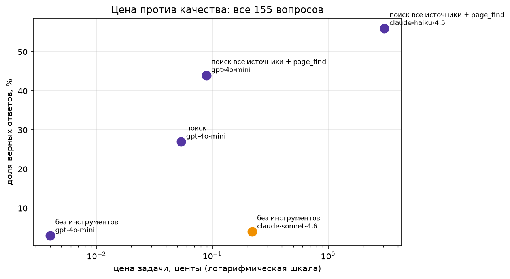

# Агент для вопросов о свежих событиях

Любая языковая модель, даже самая сильная, знает мир только до даты среза своих знаний. Спросите её, сколько людей погибло в аварии в апреле 2026 года, и она либо ответит «не знаю», либо уверенно назовёт неверное число. Размер модели здесь не помогает: нужного факта нет в её весах, его приходится приносить извне - поиском, базой знаний, памятью. Поэтому модели дают инструменты.

Но если факты приносят инструменты, дорогая модель может оказаться лишней. Тезис проекта: **дешёвая модель с хорошими инструментами отвечает на свежие вопросы не хуже сильной, а верный ответ у неё стоит в разы меньше.**

Тезис проверяется на 155 вопросах о событиях 2025-2026 годов, на которые сильная модель без инструментов не отвечает. Главная метрика - цена одного верного ответа: все траты варианта делятся на число его верных ответов.

Агент написан на чистом Python без фреймворков, модели вызываются через [OpenRouter](https://openrouter.ai).

## Этапы

Проект развивается этапами. Каждый этап проверяет новую идею на тех же вопросах и добавляет свои строки в общую таблицу результатов.

| Этап | Идея | Подробности |
|---|---|---|
| 1. ReAct-агент с живым поиском | Дешёвая модель сама ходит в Википедию и на новостные сайты и дочитывает найденную страницу | [docs/01-react-agent.md](docs/01-react-agent.md) |
| 2. RAG и память | Нужные тексты заранее лежат в векторной базе, модель получает пять нужных строк вместо всей страницы. Агент запоминает факты о пользователе, а не носит с собой всю историю диалога | [docs/02-rag-memory.md](docs/02-rag-memory.md) |

## Результаты

| этап | вариант | модель | вопросов | доля верных | цена вопроса, $ | цена верного ответа, $ |
|---|---|---|---|---|---|---|
| 1 | без инструментов | claude-sonnet-4.6 | 155 | 0.04 | 0.00221 | 0.05719 |
| 1 | без инструментов | gpt-4o-mini | 155 | 0.03 | 0.00004 | 0.00133 |
| 1 | поиск по Википедии | gpt-4o-mini | 155 | 0.27 | 0.00054 | 0.00201 |
| 1 | все источники + чтение страницы | gpt-4o-mini | 155 | 0.44 | 0.00089 | 0.00203 |
| 1 | все источники + чтение страницы | claude-haiku-4.5 | 57 | 0.56 | 0.03069 | 0.05466 |
| 2 | RAG всегда | gpt-4o-mini | 154 | 0.88 | 0.00008 | 0.00009 |
| 2 | агент с базой знаний | gpt-4o-mini | 154 | 0.92 | 0.00019 | 0.00021 |
| 2 | RAG всегда | claude-haiku-4.5 | 154 | 0.92 | 0.00077 | 0.00084 |



Ответы по каждому вопросу лежат в [results/results_raw.csv](results/results_raw.csv), полные записи диалогов агента в `traces/<вариант>/<модель>/<вопрос>.json`.

## Выводы

### Этап 1. ReAct-агент с живым поиском

1. **Сильная модель без инструментов на свежих вопросах не справляется:** 4 % верных ответов, $0.057 за верный ответ.
2. **Тезис подтверждается.** Дешёвая модель со всеми источниками точнее сильной в 11 раз (44 % против 4 %), а верный ответ у неё дешевле в 28 раз ($0.002 против $0.057).
3. **Средняя модель с теми же инструментами окупается плохо.** На 57 общих вопросах она точнее дешёвой на 9 процентных пунктов (56 % против 47 %), но верный ответ у неё дороже в 30 раз.
4. **Ограничение этапа:** 56 % вопросов остаются без верного ответа. Основные причины: поиск возвращает не ту статью, а агент тратит 4-5 шагов на чтение длинных страниц. На это направлен этап 2.

## Как запустить

Зависимости ставит [uv](https://docs.astral.sh/uv/): список лежит в `pyproject.toml`, точные версии в `uv.lock`.

```bash
curl -LsSf https://astral.sh/uv/install.sh | sh   # установить uv, если его ещё нет
uv sync                                            # создать .venv и поставить зависимости
cp .env.example .env                               # и вписать ключ OpenRouter: https://openrouter.ai/keys
uv run jupyter lab                                 # открыть ноутбук из папки notebooks/
```

В VS Code или PyCharm выберите `.venv/bin/python` ядром ноутбука. Если ключа в `.env` нет, ноутбук сразу остановится с понятной ошибкой.

Ноутбуки не тратят деньги повторно: если запись диалога по вопросу уже лежит в `traces/`, ответ берётся из неё, а модель не вызывается.

### Векторная база Milvus

Второму этапу нужна векторная база [Milvus](https://milvus.io). Она запускается в Docker одной командой из корня репозитория:

```bash
docker compose up -d        # поднять базу на localhost:19530, первый раз скачивается образ около 1 ГБ
docker compose ps           # подождать, пока статус станет healthy
docker compose down         # остановить, данные сохранятся
docker compose down -v      # остановить и стереть данные
```

Посмотреть коллекции глазами можно в веб-интерфейсе Attu: `docker compose --profile ui up -d`, затем открыть http://localhost:8000.

### Без Docker и в Kaggle

Без Docker подойдёт Milvus Lite: та же база, но живёт в одном файле рядом с ноутбуком и ставится как обычный пакет. Код ноутбука от этого не меняется, меняется только адрес базы.

```bash
uv sync --extra lite                    # поставить Milvus Lite
echo "MILVUS_URI=milvus.db" >> .env     # база будет в файле milvus.db
```

В Kaggle:

1. **Ключ.** В меню редактора **Add-ons → Secrets** добавьте секрет `OPENROUTER_API_KEY`, включите галочку напротив него и перезапустите сессию.
2. **Интернет.** В правой панели **Settings** включите **Internet**. Переключатель работает только после подтверждения телефона в профиле Kaggle.
3. **Данные.** Загрузите содержимое папки `data/` как датасет с именем `ai-agent-events-data` и подключите его к ноутбуку через **Add Input**.
4. **Пакеты и база.** Добавьте в начало ноутбука ячейку:

   ```python
   %pip install -q pymilvus milvus-lite pypdf
   import os
   os.environ["MILVUS_URI"] = "milvus.db"
   ```

## Структура репозитория

```
notebooks/   ноутбуки, по одному на этап
docs/        подробный разбор каждого этапа
data/        вопросы с эталонными ответами и цитатами из источника
scripts/     сборка и проверка набора вопросов
results/     ответы по каждому вопросу и итоговые таблицы
img/         графики, по папке на этап
traces/      полные записи диалогов агента
```
