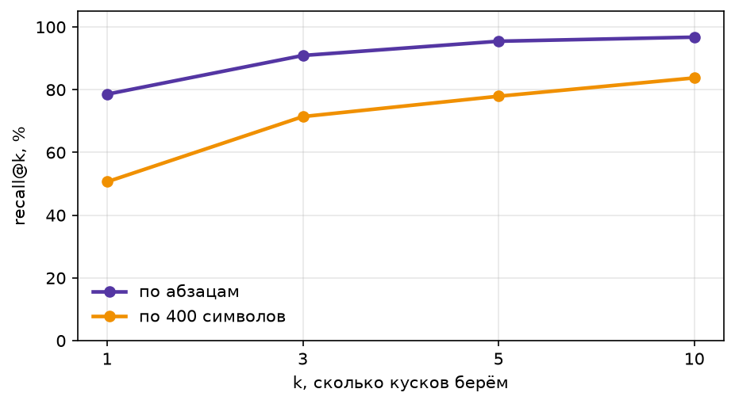

# Этап 2. RAG и память

На первом этапе агент за каждым фактом ходил в интернет: несколько шагов, длинные страницы в контексте, больше половины вопросов без ответа. Здесь нужные тексты заранее лежат в векторной базе, и модель получает несколько подходящих кусков вместо всей страницы.

Всё собрано в ноутбуке [`notebooks/02_rag_memory.ipynb`](../notebooks/02_rag_memory.ipynb).

## Корпус

50 страниц, 1,22 млн символов:

- **28 обзорных страниц английской Википедии про 2026 год** («2026», «2026 in Japan», «2026 in sports» и другие). По ним составлены основные вопросы первого этапа;
- **22 страницы для вопросов по интересам**: статьи английской и русской Википедии, новости GEN и ESPN.

Корпус собирает скрипт [`scripts/fetch_corpus.py`](../scripts/fetch_corpus.py). Он берёт готовые обзорные страницы из `data/corpus_2026.jsonl` и докачивает недостающие. Страницы Википедии скачиваются целиком вместе с таблицами, у новостей берётся только текст статьи. Во всех источниках текст сохраняется одинаково: каждый абзац, пункт списка и строка таблицы на отдельной строке, заголовки разделов в виде `== Раздел ==`.

У каждой страницы есть название и ссылка, у каждого куска - страница, раздел и ссылка, по которым человек найдёт источник.

## Вопросы

**154 вопроса с ответом** из первого этапа (`data/fresh_2026.jsonl`). У каждого есть цитата `evidence` - строка из корпуса, в которой лежит ответ. По ней определяется верный кусок при оценке поиска.

При сборке корпуса цитата не нашлась у 10 вопросов из 155. Девять исправлены так, что вопрос и ответ остались прежними: пересказанная цитата заменена на дословную строку, а у двух вопросов исправлена страница. `fresh-6` исключён: Википедия обновила цифры, и эталонный ответ устарел. Подробности в ноутбуке, раздел «Проверка цитат».

**10 вопросов без ответа** (`data/unanswerable_2026.jsonl`): по темам корпуса, но о том, чего в нём нет. Они двух видов, по пять:

- **ответа нет в корпусе, но он есть в мире**, например сколько Chai Discovery привлекла в раунде Series C. Система, которая отвечает по корпусу, должна отказаться, а агент с живым поиском может найти ответ;
- **ответа нет нигде**, например премия Тьюринга за 2026 год. Отказаться должна любая система.

## Нарезка

| Нарезка | Кусков | Как режет |
|---|---|---|
| наивная | 3072 | по 400 символов, не глядя на границы |
| по абзацам | 7282 | одна строка текста - один кусок, заголовок раздела в метаданных |

**Почему по абзацам:** абзац, пункт списка или строка таблицы - законченная мысль автора, и кусок не обрывает факт на середине.

Строки из 40 символов и короче выбрасываются: это даты-подзаголовки вроде «August 26», подписи и пункты меню. Проверка показала, что ни один вопрос из-за этого не теряет верный кусок. Длинные абзацы не делятся, кусков длиннее 800 символов 1,1 %.

## Эмбеддинги

Модель `text-embedding-3-small`, вектор укорочен до 512 чисел. Кэш лежит в `data/embeddings_512.npz`: ключ - хэш текста, значение - вектор. Недостающие тексты досчитываются пачками по 64 и дописываются в тот же файл. Первый запуск досчитал 2,7 тысячи текстов с новых страниц за $0.0046, повторный запуск не платит ничего.

## Качество поиска

`recall@k` - доля вопросов, у которых верный кусок попал в первые k найденных.

| k | 1 | 3 | 5 | 10 |
|---|---|---|---|---|
| по абзацам | 0.79 | 0.91 | 0.95 | 0.97 |
| по 400 символов | 0.51 | 0.71 | 0.78 | 0.84 |

Нарезка по абзацам находит верный кусок первым в 79 % вопросов против 51 % у наивной, и это ничего не стоит: те же тексты, другие границы.

**Выбор k:** берём k = 5. При пяти кусках верный находится у 95 % вопросов, а десять кусков добавляют чуть больше процента ценой вдвое большего контекста.
